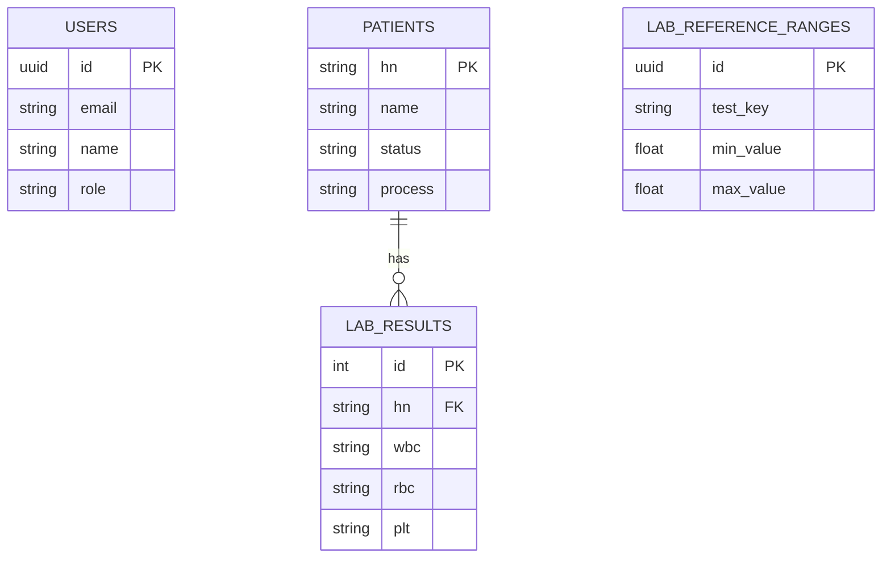

# System Analysis & ER Diagram: Bloodlink

## 1. System Overview
**Bloodlink** is a comprehensive Web Application designed for managing patient blood test workflows in a clinic or laboratory setting. It facilitates the entire process from patient registration, queuing, sample collection, lab result entry, result validation by doctors, to result delivery and historical tracking.

## 2. Technology Stack
*   **Frontend Framework:** Next.js (App Router)
*   **Language:** TypeScript
*   **Styling:** Tailwind CSS + Shadcn UI
*   **Backend & Database:** Supabase (PostgreSQL)
*   **Authentication:** NextAuth.js + Supabase Auth
*   **State Management:** React Context + Local State
*   **Real-time:** Supabase Realtime (Websockets)

## 3. Core Modules & Features
1.  **Patient Management:** Registration, Queue/Status Tracking, History.
2.  **Lab Information System (LIS):** Result Entry, Validation (Ref Ranges), Workflow (Draft/Submit).
3.  **Role-Based Access Control (RBAC):** Admin, Doctor, MedTech, Nurse.
4.  **Appointment System:** Scheduling and Tracking.
5.  **Notifications:** Internal Messaging and System Alerts.

## 4. Database Schema (ER Diagram)

*(See generated image or below structure)*

## 5. Detailed Codebase Structure

### 5.1 Core Logic (`src/lib`)
*   **`src/lib/supabase.ts`**: Central database client.
*   **`src/lib/permissions.ts`**: Security Core. Defines `Role` types and access helpers.
*   **`src/lib/services/`**: Data Access Layer (Patient, Lab, Appointment, Notification services).

### 5.2 Application Routes (`src/app`)
*   **Authentication:** `src/app/(auth)/login`
*   **Admin:** `src/app/admin` (Protected by RoleGuard)
*   **Patient Workflow:**
    *   `src/app/dashboard`: Command center.
    *   `src/app/results/[hn]/page.tsx`: **Critical**. Lab Result Entry Form with Validation Logic.
*   **API:** `src/app/api/*` (Secure endpoints).

## 6. Security Architecture
1.  **Authentication:** Secure Login via NextAuth + Supabase.
2.  **RBAC:** Strict strict access control via `RoleGuard` (Frontend) and Server-Side Checks (Backend).
3.  **RLS:** Row Level Security in Postgres ensures data isolation.

## 7. Key Decisions
*   **Why specific types?** Results stored as Text to handle special chars (`<0.1`), HNs as Text to preserve leading zeros (`00123`).
*   **Why UUIDs?** To prevent ID guessing and enumeration attacks.
